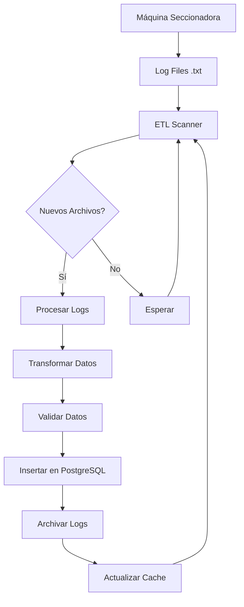
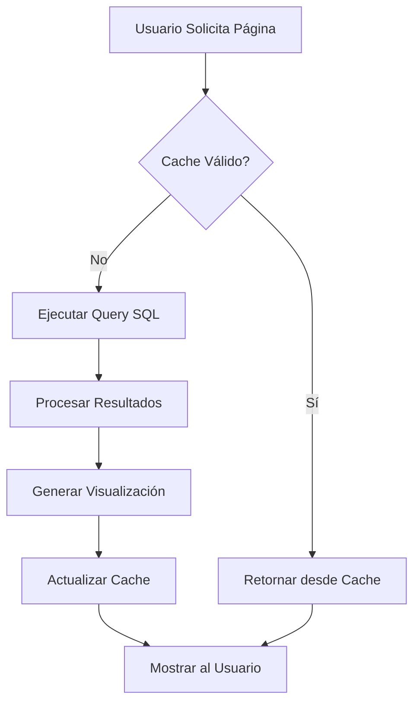

# Arquitectura del Sistema - Dashboard Seccionadora LCDC

## 🏗️ Arquitectura General

```
┌─────────────────────────────────────────────────────────────┐
│                    LCDC SUCURSAL                            │
├─────────────────────────────────────────────────────────────┤
│                                                             │
│  ┌─────────────┐    ┌──────────────┐    ┌──────────────┐   │
│  │ Seccionadora│───▶│   Log Files  │───▶│     ETL      │   │
│  │    MDF      │    │   (.txt)     │    │  Processing  │   │
│  └─────────────┘    └──────────────┘    └──────┬───────┘   │
│                                                │           │
└────────────────────────────────────────────────┼───────────┘
                                                 │
                                                 ▼
┌─────────────────────────────────────────────────────────────┐
│                  INFRAESTRUCTURA                           │
├─────────────────────────────────────────────────────────────┤
│                                                             │
│  ┌──────────────┐         ┌─────────────────┐              │
│  │ PostgreSQL   │◀────────│  Streamlit      │              │
│  │   Database   │         │  Community      │              │
│  │              │         │    Cloud        │              │
│  └──────────────┘         └─────────────────┘              │
│                                                             │
└─────────────────────────────────────────────────────────────┘
                                     │
                                     ▼
┌─────────────────────────────────────────────────────────────┐
│                 USUARIOS FINALES                           │
├─────────────────────────────────────────────────────────────┤
│                                                             │
│  👥 Operadores    👥 Supervisores    👥 Gerencia          │
│                                                             │
└─────────────────────────────────────────────────────────────┘
```

## 🛠️ Componentes del Sistema

### 1. Capa de Datos (Data Layer)

#### ETL Pipeline
```python
# etl_secc.py - Procesamiento de logs
def main():
    archivos = obtener_nuevos_logs()
    datos = procesar_logs(archivos)
    cargar_a_bd(datos)
    archivar_logs(archivos)
```

**Responsabilidades:**
- Procesar archivos de log de la máquina seccionadora
- Transformar datos al formato requerido
- Cargar datos a PostgreSQL
- Archivar archivos procesados

#### Base de Datos PostgreSQL
```sql
-- Estructura optimizada para analytics
CREATE TABLE cortes_seccionadora (
    id SERIAL PRIMARY KEY,
    -- Campos de negocio
    nombre_optimizacion VARCHAR(255),
    job_key VARCHAR(255),
    fecha_proceso DATE,
    -- Campos calculados automáticamente
    duracion_segundos INTEGER GENERATED ALWAYS AS (...) STORED,
    area_mm2 DECIMAL GENERATED ALWAYS AS (...) STORED
);

-- Vistas precalculadas para performance
CREATE VIEW metricas_diarias AS ...
CREATE VIEW analisis_por_job AS ...
```

### 2. Capa de Configuración (Configuration Layer)

#### Gestión de Configuración
```python
# config.py - Configuración centralizada
class Config:
    def __init__(self):
        self.environment = self._detect_environment()
        self.database_url = self._get_database_url()
        self.cache_ttl = 300  # 5 minutos
    
    def _detect_environment(self):
        # Auto-detecta: local, streamlit_cloud
        return environment
```

**Características:**
- **Auto-detección de entorno**: Local vs Streamlit Cloud
- **Gestión de secrets**: Variables de entorno seguras
- **Validación**: Configuración robusta con mensajes de error
- **Flexibilidad**: Fácil adaptación a nuevos entornos

### 3. Capa de Aplicación (Application Layer)

#### Dashboard Principal
```python
# dashboard_streamlit.py
def main():
    validate_config()
    validate_db_connection()
    render_navigation()
    render_selected_page()
```

**Páginas del Dashboard:**
1. **Overview General**: KPIs principales y tendencias
2. **Análisis Diario**: Métricas filtradas por fecha
3. **Análisis por Espesores**: Comparación de materiales
4. **Análisis por Jobs**: Rendimiento por trabajo

#### Sistema de Cache
```python
@st.cache_data(ttl=config.cache_ttl)
def load_data(query: str) -> pd.DataFrame:
    # Cache inteligente con TTL configurable
    return execute_query(query)
```

### 4. Capa de Presentación (Presentation Layer)

#### Visualizaciones Interactivas
```python
# Plotly para gráficos dinámicos
fig = px.scatter(data, x='tiempo', y='eficiencia', 
                size='placas', color='espesor')
st.plotly_chart(fig, use_container_width=True)
```

**Tipos de Visualización:**
- **KPI Cards**: Métricas principales
- **Time Series**: Tendencias temporales
- **Scatter Plots**: Correlaciones
- **Bar Charts**: Comparaciones
- **Tablas Interactivas**: Datos detallados

## 🔄 Flujo de Datos

### Proceso ETL Completo


### Flujo de Consulta del Dashboard


## 🏛️ Patrones de Arquitectura Implementados

### 1. Configuration Pattern
- **Centralizada**: Una clase Config para toda la app
- **Por Entorno**: Diferentes configuraciones según el deploy
- **Validación**: Verificación automática de configuración

### 2. Repository Pattern
```python
class DataRepository:
    def __init__(self, engine):
        self.engine = engine
    
    def get_daily_metrics(self, date_range):
        return self.load_data(DAILY_METRICS_QUERY)
```

### 3. Factory Pattern
```python
def create_connection():
    if config.environment == "streamlit_cloud":
        return create_cloud_connection()
    else:
        return create_local_connection()
```

## 🔒 Seguridad

### Gestión de Credenciales
```python
# Nunca hardcodeado
if config._is_streamlit_cloud():
    db_url = st.secrets["database"]["PG_CONN"]
else:
    db_url = os.getenv("PG_CONN")
```

### Principio de Menor Privilegio
```sql
-- Usuario específico solo con permisos de lectura
CREATE USER dashboard_user WITH PASSWORD 'secure_password';
GRANT SELECT ON ALL TABLES IN SCHEMA public TO dashboard_user;
```

## 📈 Escalabilidad

### Horizontal Scaling
- **Multi-sucursal**: Un deployment por sucursal
- **Datos centralizados**: PostgreSQL compartido con filtros
- **CDN**: Streamlit Cloud maneja distribución global

### Vertical Scaling
- **Base de datos**: Migración a instancias más grandes
- **Cache**: Ajuste de TTL según volumen de datos
- **Índices**: Optimización de consultas SQL

### Límites Actuales
```yaml
Streamlit Community Cloud:
  CPU: 1 core compartido
  RAM: 1GB máximo
  Storage: Sin persistencia local
  Bandwidth: Limitado pero suficiente
  Uptime: ~99% (servicio gratuito)
```

## 🔄 CI/CD Pipeline

### GitHub Actions Workflow
```yaml
on:
  push:
    branches: [ main ]

jobs:
  test:
    - Lint código (flake8)
    - Validar imports
    - Test configuración
    
  deploy:
    - Notificar deployment exitoso
    - Auto-deploy en Streamlit Cloud
```

### Deploy Automático
1. **Push a main** → Trigger GitHub Actions
2. **Tests pasan** → Streamlit Cloud detecta cambios
3. **Auto-deploy** → Nueva versión en producción
4. **Health check** → Validación automática

## 🎯 Decisiones de Arquitectura

### ¿Por qué Streamlit Cloud?
✅ **Pros:**
- Zero-config deployment
- SSL automático
- Scaling automático
- Costo $0
- Mantenimiento mínimo

⚠️ **Contras:**
- Repositorio público requerido
- Recursos limitados
- Sin control de infraestructura

### ¿Por qué PostgreSQL?
✅ **Ventajas:**
- Vistas materializadas para performance
- Campos calculados automáticos
- ACID compliance
- Índices optimizados
- Amplio soporte

### ¿Por qué Python/Pandas?
✅ **Justificación:**
- ETL nativo y eficiente
- Visualizaciones avanzadas
- Ecosistema maduro
- Fácil mantenimiento por equipo LCDC

## 🔮 Roadmap de Arquitectura

### Fase 2: Mejoras de Performance
- [ ] Implementar cache Redis
- [ ] Queries asíncronas
- [ ] Lazy loading de datos

### Fase 3: Multi-tenancy
- [ ] Filtros por sucursal
- [ ] Dashboard consolidado
- [ ] Roles y permisos

### Fase 4: Advanced Analytics
- [ ] ML para predicción de mantenimiento
- [ ] Alertas automáticas
- [ ] Reportes PDF automáticos

---

*Documentación de Arquitectura - Dashboard Seccionadora LCDC v1.0*