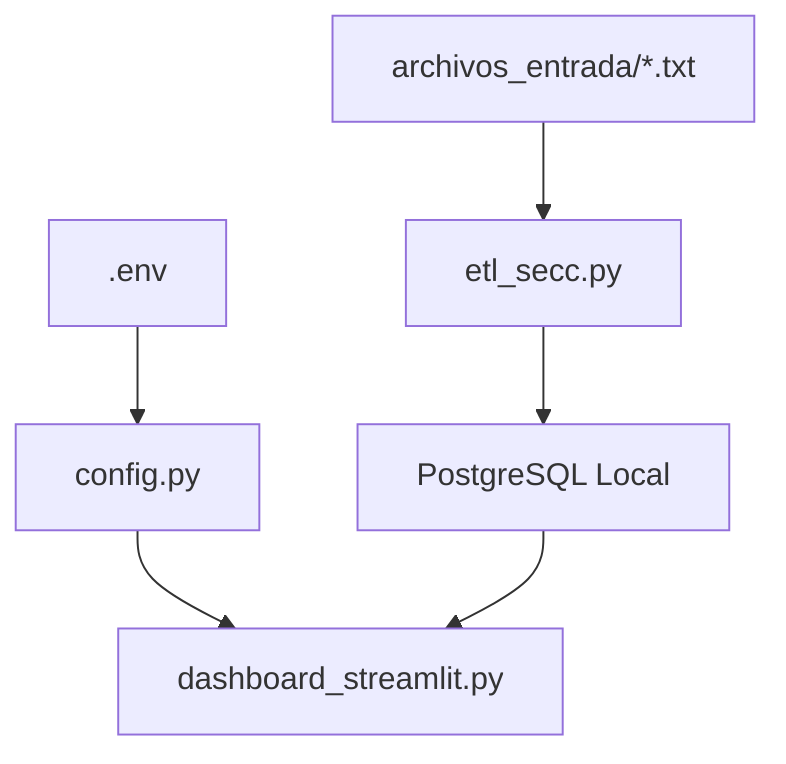
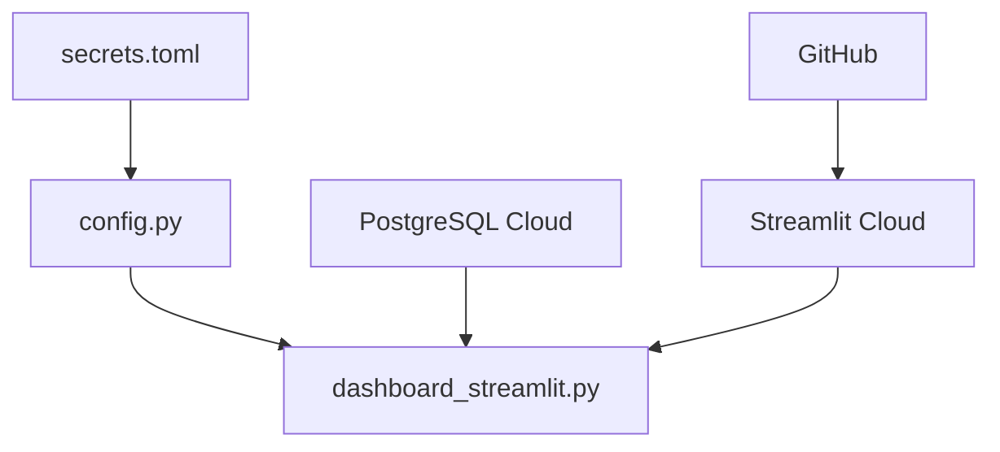

# Estructura del Proyecto - Dashboard Seccionadora LCDC

## 📁 Estructura de Archivos

```
dashboard-seccionadora-lcdc/
├── 📄 dashboard_streamlit.py          # 🚀 Aplicación principal Streamlit
├── 📄 config.py                       # ⚙️  Configuración centralizada
├── 📄 etl_secc.py                     # 🔄 Pipeline ETL
├── 📄 script_seccionadora.py          # 📊 Parser de logs
├── 📄 init_database.sql               # 🗄️  Schema de base de datos
│
├── 📄 requirements.txt                # 📦 Dependencias Python (versiones fijas)
├── 📄 pyproject.toml                  # 📋 Metadata del proyecto
├── 📄 .env.example                    # 🔐 Plantilla de variables de entorno
├── 📄 .gitignore                      # 🚫 Archivos a ignorar en Git
│
├── 📁 .github/workflows/
│   └── 📄 deploy.yml                  # 🔧 CI/CD con GitHub Actions
│
├── 📁 .streamlit/
│   └── 📄 config.toml                 # 🎨 Configuración UI de Streamlit
│
├── 📁 archivos_entrada/               # 📥 Logs nuevos de la máquina
├── 📁 procesados/                     # 📦 Logs ya procesados (archivados)
│
├── 📄 secrets.toml.example            # 🔒 Ejemplo de secrets para Streamlit Cloud
│
├── 📄 README.md                       # 📖 Documentación principal
├── 📄 DEPLOYMENT_GUIDE.md             # 🚀 Guía paso a paso de deployment
├── 📄 ARCHITECTURE.md                 # 🏗️  Documentación de arquitectura
└── 📄 PROJECT_STRUCTURE.md            # 📁 Este archivo
```

## 🎯 Descripción de Componentes

### 🚀 Aplicación Principal
| Archivo | Función | Responsabilidad |
|---------|---------|----------------|
| `dashboard_streamlit.py` | Dashboard principal | Interface de usuario, visualizaciones, navegación |
| `config.py` | Configuración | Gestión de entornos, variables, validación |

### 🔄 Procesamiento de Datos
| Archivo | Función | Responsabilidad |
|---------|---------|----------------|
| `etl_secc.py` | ETL Pipeline | Orchestación del procesamiento de logs |
| `script_seccionadora.py` | Parser | Lectura y transformación de archivos de log |
| `init_database.sql` | Schema DB | Estructura de tablas, vistas e índices |

### ⚙️ Configuración y Deploy
| Archivo | Función | Responsabilidad |
|---------|---------|----------------|
| `requirements.txt` | Dependencias | Librerías Python con versiones fijas |
| `pyproject.toml` | Metadata | Información del proyecto y herramientas dev |
| `.env.example` | Variables | Plantilla para configuración local |
| `.github/workflows/deploy.yml` | CI/CD | Automatización de tests y deployment |

### 📚 Documentación
| Archivo | Función | Audiencia |
|---------|---------|-----------|
| `README.md` | Overview técnico | Desarrolladores y administradores |
| `DEPLOYMENT_GUIDE.md` | Guía práctica | Técnicos LCDC para deployment |
| `ARCHITECTURE.md` | Diseño del sistema | Arquitectos y desarrolladores senior |

### 📁 Directorios de Datos
| Directorio | Función | Contenido |
|------------|---------|-----------|
| `archivos_entrada/` | Logs nuevos | Archivos .txt generados por la máquina |
| `procesados/` | Archivo histórico | Logs ya procesados con timestamp |
| `.streamlit/` | Config UI | Temas y configuración visual |

## 🔒 Archivos Sensibles (.gitignore)

```bash
# ❌ NUNCA commitear estos archivos
.env                    # Variables de entorno locales
*.log                   # Archivos de log
procesados/             # Datos históricos
archivos_entrada/*.txt  # Logs de producción
.streamlit/secrets.toml # Secrets locales
```

## 📦 Dependencias y Versiones

### Core Dependencies
```python
pandas==2.1.4           # Procesamiento de datos
sqlalchemy==2.0.25      # ORM y conexión DB
psycopg2-binary==2.9.9  # Driver PostgreSQL
streamlit==1.29.0       # Framework web
plotly==5.17.0          # Visualizaciones
```

### Utilities
```python
python-dotenv==1.0.0    # Variables de entorno
requests==2.31.0        # HTTP requests
typing-extensions==4.9.0 # Type hints
```

## 🔄 Flujo de Archivos

### Desarrollo Local


### Producción (Streamlit Cloud)


## 🛠️ Comandos Útiles

### Desarrollo Local
```bash
# Instalar dependencias
pip install -r requirements.txt

# Configurar entorno
cp .env.example .env
# Editar .env con credenciales reales

# Ejecutar dashboard
streamlit run dashboard_streamlit.py

# Procesar logs (ETL)
python etl_secc.py
```

### Testing
```bash
# Validar sintaxis
python -m flake8 dashboard_streamlit.py config.py

# Test de imports
python -c "from config import config; print(config.environment)"

# Validar requirements
pip-compile --dry-run requirements.txt
```

### Deployment
```bash
# Preparar para deployment
git add .
git commit -m "Deployment ready"
git push origin main

# GitHub Actions ejecuta automáticamente
# Streamlit Cloud detecta y redeploya
```

## 📊 Métricas del Proyecto

### Líneas de Código
```
dashboard_streamlit.py:  ~800 líneas
config.py:              ~150 líneas
etl_secc.py:            ~80 líneas
script_seccionadora.py:  ~50 líneas
Total Python:           ~1,080 líneas
```

### Archivos de Configuración
```
.github/workflows/:     ~80 líneas YAML
.streamlit/:           ~10 líneas TOML
requirements.txt:      ~10 líneas
pyproject.toml:        ~50 líneas TOML
```

### Documentación
```
README.md:              ~300 líneas
DEPLOYMENT_GUIDE.md:    ~400 líneas
ARCHITECTURE.md:        ~500 líneas
Total Docs:            ~1,200 líneas
```

## 🎯 Principios de Organización

### 1. Separación de Responsabilidades
- **UI**: `dashboard_streamlit.py`
- **Configuración**: `config.py`
- **Datos**: `etl_secc.py`, `script_seccionadora.py`
- **Deploy**: `.github/workflows/`, `requirements.txt`

### 2. Configuración Centralizada
- Una sola fuente de verdad: `config.py`
- Auto-detección de entorno
- Validación robusta

### 3. Documentación Como Código
- Markdown junto al código
- Guías prácticas para técnicos
- Arquitectura documentada

### 4. Seguridad Por Diseño
- Secrets nunca en el código
- `.gitignore` comprehensivo
- Permisos mínimos en DB

---

*Estructura de Proyecto - Dashboard Seccionadora LCDC v1.0*